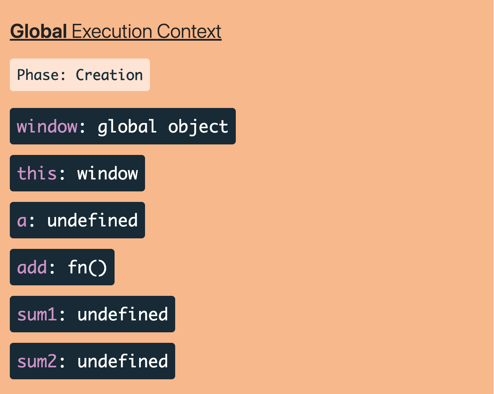
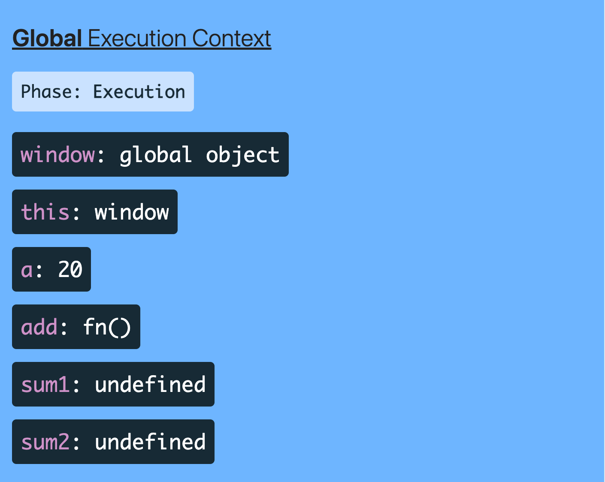

### JavaScript Execution 
## Global EC
   --> **Global execution contest** - 
   1. first phase (creation phase) it allocate memory to the variables and functions
   
2. second phase (Execution phase) it executed line by line and it is defining variables in memory here. Every function invoked creates its own local execution context, which is put in call stack.


--> **Function execution contest** - 

--> **Eval Execution contest**
   
 
 ### memory creation phase
 only the place is executed

 Memory Creation Phase is also known as the Variable Environment. In the Memory creation phase, the memory will be allocated to all variables and functions inside the Global Execution Context. In this phase, variable declarations are scanned and made undefined. It stores undefined to all variables.

 ###  execution phase
 When the JavaScript interpreter find an error in code's syntax or on the execution of the code it will throw an exception. These exceptions can halt the execution of the script if they are not properly handled using try... catch blocks.

 ## steps to execute the javascript code
 ```javascript
 let var1 =20
 let var2 = 30
 function addtwo(num1,num2) {
    let total =num1 + num2
    return total
 }
 let result1 = addtwo(var1,var2)
 let result2 = addtwo(13,46)
 ```
____






### the above code will execute the JavaScript code as
1.Global exection --> this
2.memory phase
* var1--> undefined 
* var2--> undefined
* addtwo--> defined
* result1 --> undefined
* result2 --> undefined
  
3. exection phase 
* var1 <-- 10
* var2 <-- 30
* addtwo --> new varibale + enviornment + exection thread (automatically delete after exection)                              
  * it have memory  phase  
* var1--> undefined 
* var2--> undefined  
* total--> undefined 
                              
  * and exection phase  
* num1-->10
* num2-->30
* total-->40 


### global exection
onetwo()
function()
two()
* follows LIFO order for multiple functions
  
* call stack
